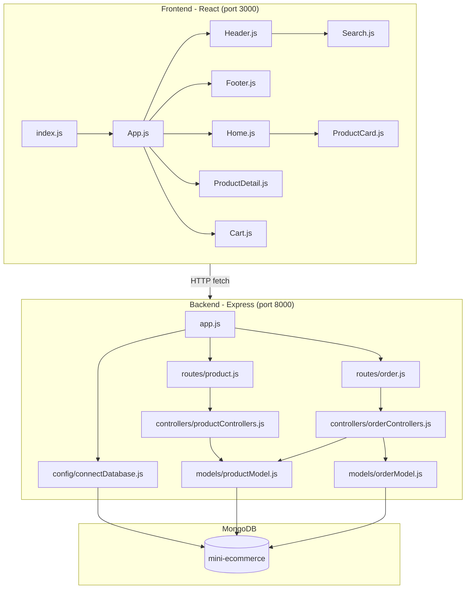
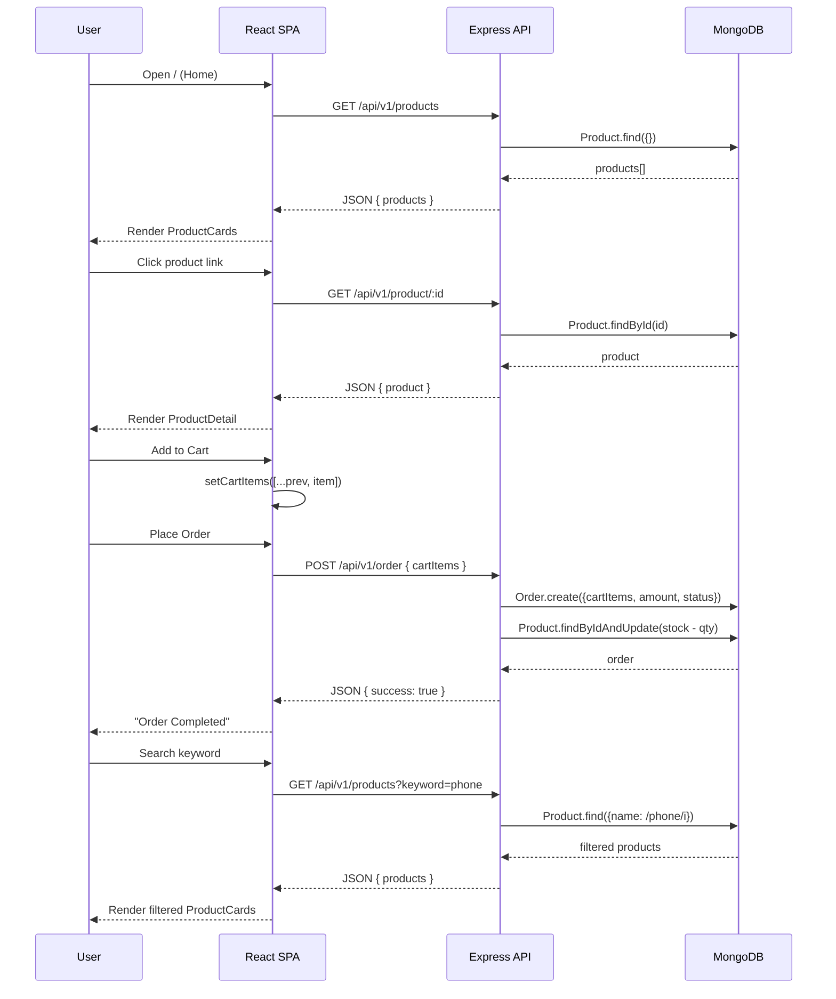
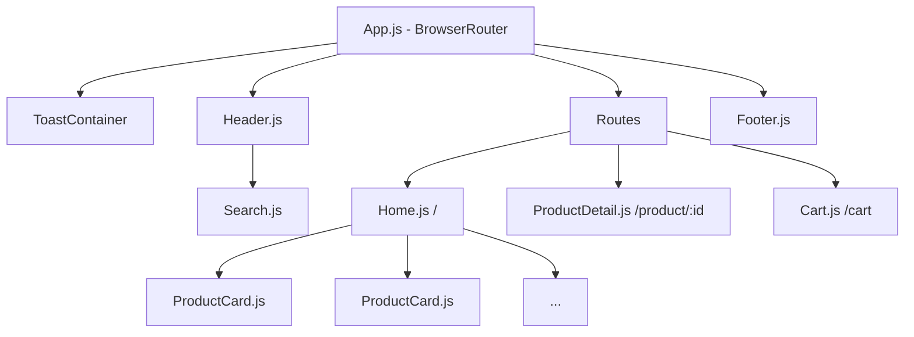

# JVL-Ecommerce Architecture

## System Overview



## Data Flow



## File Dependency Graph

```
frontend/public/index.html
  └── (loads React bundle)

frontend/src/index.js
  ├── React
  ├── ReactDOM
  ├── ./index.css
  └── ./App

frontend/src/App.js
  ├── ./App.css                          (styling)
  ├── ./components/Header                (nav bar)
  │     ├── ./Search                     (keyword input)
  │     │     ├── react (useState)
  │     │     └── react-router-dom (useNavigate)
  │     └── react-router-dom (Link)
  ├── ./components/Footer                (footer)
  ├── ./pages/Home                       (product listing)
  │     ├── react (useEffect, useState)
  │     ├── react-router-dom (useSearchParams)
  │     └── ../components/ProductCard    (card UI)
  │           └── react-router-dom (Link)
  ├── ./pages/ProductDetail              (product details + add to cart)
  │     ├── react (useEffect, useState)
  │     ├── react-router-dom (useParams)
  │     └── react-toastify (toast)
  ├── ./pages/Cart                       (cart management + order)
  │     ├── react (useState)
  │     └── react-router-dom (Link)
  ├── react-router-dom (BrowserRouter, Routes, Route)
  ├── react (useState)
  └── react-toastify (ToastContainer, CSS)

backend/app.js (entry point)
  ├── dotenv         →  backend/config/config.env
  ├── express
  ├── cors
  ├── ./config/connectDatabase
  │     └── mongoose  →  backend/config/config.env (DB_URL)
  ├── ./routes/product
  │     └── ../controllers/productControllers
  │           └── ../models/productModel → mongoose
  └── ./routes/order
        └── ../controllers/orderControllers
              ├── ../models/orderModel  → mongoose
              └── ../models/productModel → mongoose
```

## Route Map

| Method | URL | Component / Controller | Description |
|--------|-----|----------------------|-------------|
| `GET` | `/` | `Home.js` | Product listing page |
| `GET` | `/search?keyword=...` | `Home.js` | Filtered product listing |
| `GET` | `/product/:id` | `ProductDetail.js` | Single product details |
| `GET` | `/cart` | `Cart.js` | Shopping cart |
| `GET` | `/api/v1/products` | `getProducts` | API: all/filtered products |
| `GET` | `/api/v1/product/:id` | `getSingleProduct` | API: single product |
| `POST` | `/api/v1/order` | `createOrder` | API: place order |

## State Management

```
App.js (useState)
  └── cartItems ──props──► Header.js (cart count badge)
  └── cartItems, setCartItems ──props──► ProductDetail.js (add to cart)
  └── cartItems, setCartItems ──props──► Cart.js (display, modify, order)
```

## Component Tree



## Key Configuration

| File | Key Settings |
|------|-------------|
| `backend/config/config.env` | PORT=8000, DB_URL=mongodb://localhost:27017/mini-ecommerce |
| `frontend/.env` | REACT_APP_API_URL=http://localhost:8000/api/v1 |
| `backend/package.json` | Express 5, Mongoose 9, Cors, Dotenv |
| `frontend/package.json` | React 19, React Router DOM 7, React Toastify 11 |
